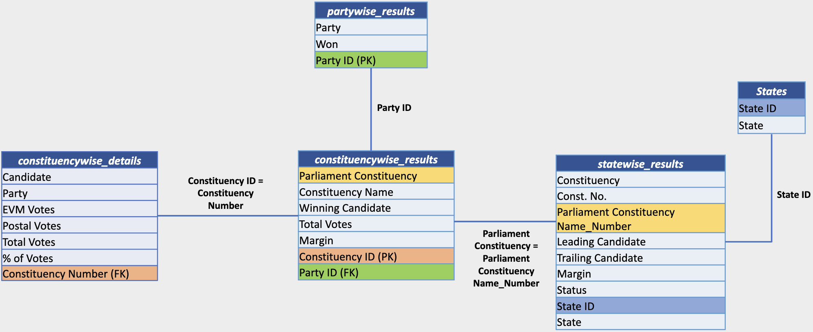

# Indian General Elections Insights – Power BI Project

## Project Overview

**Indian General Elections Insights** is a comprehensive Power BI dashboard that visualizes, analyzes, and presents data-driven insights from the 2024 Indian General Elections. Designed for political analysts, data enthusiasts, and students, this project enables granular exploration from national to constituency levels, with rich visual summaries and interactive interface.


## Folder & Repository Structure
```text
Indian-general-elections-insights/
│
├── raw data/ # CSV datasets: constituencies, parties, states, results
│ ├── constituencywise_details.csv
│ ├── constituencywise_results.csv
│ ├── partywise_results.csv
│ ├── states.csv
│ └── statewise_results.csv
│
├── elements/ # Visual assets and icons
│ ├── party logos/ # Individual logos for 35+ parties
│ ├── EVM.png, Flag_of_India.png, Modi.png, ...
│
├── images/ # Reference images/diagrams
│ └── ERD.png # Entity Relationship Diagram
│
├── Indian General Elections.sql # SQL scripts for data import & analysis
├── Party Alliance DAX.txt # DAX formulas for Power BI
├── power bi project.pbix # Main Power BI dashboard
├── LICENSE # MIT license
└── README.md # Project documentation
```

## ⚙️ Tech Stack

- **Power BI:** Visualization, analysis, dashboard creation  
- **SQL Server:** ETL, data wrangling, query logic  
- **DAX:** Calculated columns & business metrics in Power BI  
- **CSV:** Base data storage format  
- **PNG/SVG:** Logos, icons, backgrounds for dashboard polish  

## How to Use / Setup Steps

1. **Clone the Repository**
git clone https://github.com/saiyam-jain0/Indian-general-elections-insights.git
cd Indian-general-elections-insights

2. **Set Up Data**
- Place CSV files from `raw data/` into your database.
- Use SQL scripts from `Indian General Elections.sql` for importing and preparing data.

3. **Open Power BI Dashboard**
- Launch Power BI Desktop
- Load `power bi project.pbix`
- Refresh connections to ensure latest data import

4. **Explore Dashboards**
- Utilize included navigation (Landing Page) to access different types of analysis:
  - Overview Analysis
  - State Demographic Analysis
  - Political Landscape by State
  - Constituency Analysis
  - Details Grid (full data table)
- Use filters, slicers, and drill-through features for constituency-specific and state-specific results.


## Screenshots & Dashboard Walkthrough (Lucknow Example)

### 1. Landing Page
Navigate easily between different dashboard views.  


---

### 2. Overview Analysis Dashboard  
NDA, I.N.D.I.A, and Others alliance seat distributions and party summary.  


---

### 3. State Demographic Analysis  
Visualizes seats, winning candidates, and party-wise performances across states.  


---

### 4. Political Landscape by State (Uttar Pradesh Example)  
Explore party seat shares and alliance performance in Uttar Pradesh.  


---

### 5. Constituency Analysis (Lucknow)  
Key statistics including total votes, EVM vs postal votes, winners and runners-up.  


---

### 6. Details Grid  
Comprehensive sortable and filterable data table of electoral results.  


---

### 7. ERD Diagram  
Entity Relationship Diagram illustrating database structure and relationships.  



##  Key Features

- **Interactive Navigation:** Easily select dashboards for different insight dimensions.
- **National and State-Level Analysis:** Drill down from nationwide coalitions to individual state/constituency performance.
- **Party & Alliance Focus:** Visual tracking of NDA and I.N.D.I.A. seat wins.
- **Constituency Deep-dive:** All candidates and vote shares for each constituency.
- **Robust Data Table:** Sort, filter, and export all result data as needed.


## SQL & DAX Highlights

- **SQL queries for:** Seat counts, party wins, alliance breakout, vote margin calculation, EVM/postal vote segmentation, winner/runner-up logic.
- **DAX formulas:** Mapping parties to alliances (NDA, I.N.D.I.A., Others) for fast analysis in Power BI visuals.


## About the Author

**Saiyam Jain**  
B.Tech, Production & Industrial Engineering, MNNIT Allahabad  
- Email: saiyamlko@gmail.com  
- LinkedIn: [Saiyam Jain](https://linkedin.com/in/saiyam-jain)  
- GitHub: [saiyam-jain0](https://github.com/saiyam-jain0)


## License

MIT License — Free for academic, analytical, and portfolio use.

## Contributing & Support

Open to contributions and suggestions. Fork, create a pull request, or reach out at the contacts above for collaborations or feedback.


